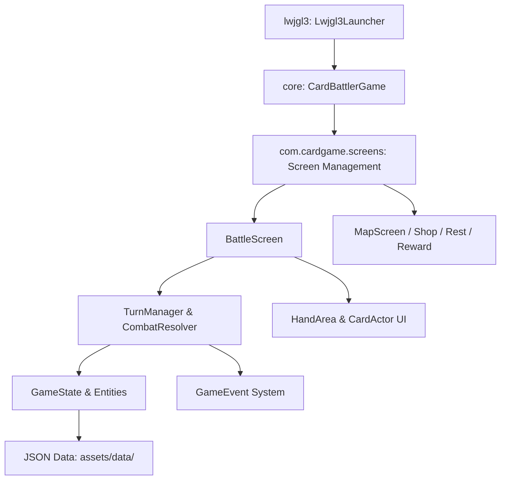

# Project Overview

Card Battler (Locura) is a roguelike deckbuilding game built in Java 17 using the libGDX
framework and LWJGL3 desktop backend. Inspired by psychological horror and classic turn-based
card battlers like Slay the Spire, players navigate node-based maps, draft insanity-themed cards,
manage relics and potions, and battle grotesque aberrations using an event-driven combat system.

## Repository Structure

* `assets/`: Stores game assets including textures, fonts, audio, and JSON definitions.
* `core/`: Houses backend-agnostic core game logic, screens, event bus, entities, and UI actors.
* `gradle/`: Contains the Gradle wrapper binaries and configuration.
* `lwjgl3/`: Provides the desktop launcher module and LWJGL3 platform-specific backend wiring.
* `run.bat`: Windows batch script to launch the desktop game from the command line.

## Build & Development Commands

### Prerequisites
* Java Development Kit (JDK) 17 or higher
* Gradle wrapper (included in repo)

### Build & Compile
```bash
# Compile Java source across all modules
./gradlew compileJava

# Build all subprojects and assemble jars
./gradlew assemble
```

On Windows PowerShell/cmd:
```powershell
.\gradlew.bat compileJava
.\gradlew.bat assemble
```

### Run Locally
```bash
# Launch desktop client via Gradle
./gradlew :lwjgl3:run
```

Or using project convenience scripts:
```powershell
# From repo root or VP-Project directory
.\run.bat
```

### Testing
```bash
# Execute JUnit 5 tests in the core module
./gradlew test
```

### Clean
```bash
# Delete generated build outputs and Gradle caches
./gradlew clean
```

### Lint & Type-Check
> TODO: No dedicated linter (e.g., Checkstyle or Spotless) is configured in build.gradle.
Compile-time static type-checking is enforced during `compileJava`:
```bash
./gradlew compileJava --warning-mode all
```

### Debugging
Run the launcher with JVM remote debugging arguments:
```bash
./gradlew :lwjgl3:run --debug-jvm
```

### Distribution & Packaging
```bash
# Create distributable desktop application jar
./gradlew :lwjgl3:dist
```
> TODO: Setup deployment pipelines for Steam, itch.io, or multi-platform native bundles.

## Code Style & Conventions

### Formatting & Language Standards
* **Java Version**: Java 17 LTS syntax and standard libraries.
* **Character Encoding**: UTF-8 enforced across all compilation tasks.
* **Imports**: Group imports standardly; avoid unused or wildcard imports (`import foo.*`).
* **Naming Conventions**:
  * Classes and Interfaces: PascalCase (e.g., `CombatResolver`, `AbstractCard`).
  * Methods and Variables: camelCase (e.g., `calculateDamage`, `cardImage`).
  * Constants: UPPER_SNAKE_CASE (e.g., `Constants.SCREEN_WIDTH`).
  * Package Structure: lowercase under `com.cardgame.*`.

### Architecture Boundaries
* Code inside `core/` must never import `com.badlogic.gdx.backends.lwjgl3.*` or LWJGL classes.
* Data structures and combat resolution in `com.cardgame.logic.*` should remain testable
  without requiring an active OpenGL/LWJGL graphics context.

### Commit Message Template
Follow conventional, imperative commit messages:
```text
<type>(<scope>): <short imperative summary>

[optional body explaining rationale and behavioral changes]
```
Examples from project history:
* `feat(cards): add DelusionalStrikeCard and insanity status effect`
* `fix(ui): clean up unused imports and resolve CardActor layout warnings`
* `chore(build): apply eclipse plugin and configure Java 17 compatibility`

## Architecture Notes



### Component Breakdown
1. **Desktop Entry (`lwjgl3`)**: `Lwjgl3Launcher` configures screen dimensions (1440x900),
   VSync, framerate, and delegates lifecycle to `CardBattlerGame`.
2. **Game Orchestrator (`CardBattlerGame`)**: Extends libGDX `Game`; controls screen transitions
   via `setScreen()`, global asset managers, fonts, and shared audio.
3. **Screen Flow (`com.cardgame.screens`)**: Handles screen-specific stages and viewports
   (e.g., `MainMenuScreen`, `MapScreen`, `BattleScreen`, `ShopScreen`, `RestScreen`).
4. **Combat Engine (`com.cardgame.logic`)**:
   * `TurnManager` and `CombatResolver` govern turn phases, player energy, actions, and end turns.
   * `AbstractCard`, `AbstractMonster`, `AbstractRelic`, `AbstractPotion` define combat entity logic.
   * `GameEvent` hierarchy dispatches damage, block, turns, and status effect events.
5. **Data Layer (`assets/data/`)**: External JSON files (`cards.json`, `monsters.json`,
   `potions.json`, `relics.json`) loaded via Gson / libGDX Json utilities.

## Testing Strategy

* **Unit Testing Framework**: JUnit 5 (`org.junit.jupiter:junit-jupiter:5.11.3`) configured
  in `core/build.gradle`.
* **Execution**:
  ```bash
  ./gradlew :core:test
  ```
* **Decoupled Architecture**: Logic tests run without initializing LWJGL3 display backends.
* > TODO: Populate `core/src/test/java/` with automated unit and regression test suites.
* > TODO: Configure Continuous Integration (CI) workflows (e.g., GitHub Actions) to run tests.

## Security & Compliance

* **Secrets & Credentials**: No API keys, passwords, or personal access tokens should be committed.
* **Dependencies**: External dependencies managed through Gradle Central Maven repository:
  * `com.badlogicgames.gdx:gdx:1.12.1`
  * `com.google.code.gson:gson:2.11.0`
  * `org.junit.jupiter:junit-jupiter:5.11.3`
* **Licensing**:
  > TODO: Add formal open-source or proprietary LICENSE file to repository root.
  Verify distribution licenses for bundled third-party audio, fonts (`VT323-Regular.ttf`),
  and image assets in `assets/`.

## Agent Guardrails

* **Untouched Files**:
  * Do NOT manually edit or commit files inside `.gradle/`, `build/`, `core/bin/`, `lwjgl3/bin/`.
  * Do NOT modify wrapper binaries `gradle/wrapper/gradle-wrapper.jar` unless upgrading Gradle.
  * Do NOT add graphics dependencies (`gdx-backend-lwjgl3`) into `core/build.gradle`.
* **Asset Handling**:
  * Maintain correct JSON schemas in `assets/data/` when modifying card, monster, or relic stats.
  * Large media assets should reside in `assets/` and avoid unnecessary duplication.
* **Workspace Navigation**:
  * Git commands must target the directory containing `.git` (`VP-Project/`).
  * Ensure path compatibility across Windows and POSIX environments.

## Extensibility Hooks

* **Card System**: Extend `com.cardgame.logic.cards.AbstractCard` and register definitions in
  `assets/data/cards.json`.
* **Monster System**: Subclass `com.cardgame.logic.monsters.AbstractMonster` and add corresponding
  monster intents and baseline stats in `assets/data/monsters.json`.
* **Relics & Potions**: Subclass `AbstractRelic` or `AbstractPotion` and add triggers via
  combat event subscribers.
* **Custom Game Modes / Rooms**: Implement subclasses under `com.cardgame.logic.rooms.AbstractRoom`.
* > TODO: Add environment variable overrides and configuration flags for debug overlays.

## Further Reading

* > TODO: Add docs/ARCH.md for complete class-level architecture diagrams.
* > TODO: Add docs/CARDS.md documenting card syntax, status effects, and damage formulae.
* > TODO: Add docs/CONTRIBUTING.md detailing pull request workflows and branching strategies.
